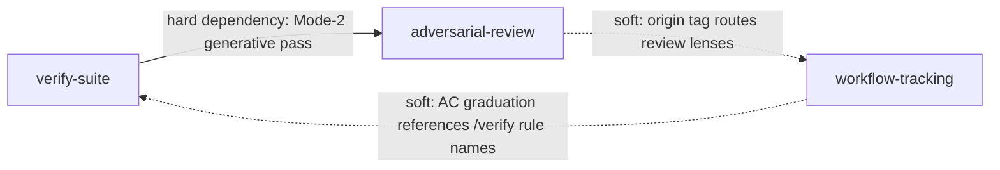

# agentic-setup plugin marketplace

A Claude Code plugin marketplace: three composable plugins for spec/design/task quality gating, generative red-team review, and AC-oriented workflow & agent-team progress tracking.

## The three plugins

| Plugin | What it ships | Standalone? |
|--------|---------------|-------------|
| **adversarial-review** | Generative Mode-2 red-team review of any artifact (spec/design/code/doc). Extracts stated intent, spawns 1-3 grounded critic lenses (Skeptic / Architect / Minimalist), runs a refute pass, and synthesizes a severity-rated **advisory soft-gate** report — it surfaces concerns, never auto-blocks. Skill + lens references + the `adversarial-reviewer` critic agent. | Yes — no plugin dependencies |
| **verify-suite** | The verification engine and its **durable acceptance-criteria rule-pack** (the AC library under `skills/verify/rules/`), the `verify-*` review-skill family (`verify-spec`, `verify-requirements`, `verify-design`, `verify-task`, `verify-note`, `verify-format`, `verify-content`), and the `artifact-flow` task-class router. Includes a `PreToolUse` Write/Edit hook that injects the applicable rule manifest before a file write. | No — **depends on `adversarial-review`** |
| **workflow-tracking** | AC-oriented progress tracking for multi-step workflows and agent teams: the **task-tool MCP** server (workflow state machines, append-only history, ACs, resumable sessions), a `workflow-tracking` guidance skill (when to use task-tool vs the native task list), and a non-blocking `advance` nudge hook that reminds you to record review evidence at gate checkpoints. | Yes |

## Dependency and coupling edges



### Hard dependency (declared)
- **verify-suite → adversarial-review.** verify-suite's engine invokes the adversarial-review skill as its Mode-2 / Step 9.5 advisory pass. This is declared in `verify-suite/.claude-plugin/plugin.json` via `dependencies: ["adversarial-review"]`. Install adversarial-review alongside verify-suite.

### Soft couplings (work without each other, degrade gracefully)
- **workflow-tracking AC graduation ↔ verify-suite rules.** A task-tool acceptance criterion can point to a `/verify` rule name as its durable standard — the same rule a worker duplicates into its stage so worker and lead hold one bar. Without verify-suite, ACs still function as free-text criteria; the rule-name reference is just unresolved.
- **adversarial-review provenance routing ↔ workflow-tracking origin tags.** When an artifact carries a task-tool `origin: user|ai` tag, adversarial-review reads it to route its critic lenses (e.g. cost/benefit vs traceability/necessity emphasis). This is a soft signal — adversarial-review works fully when no `origin` tag is present.

Neither soft edge is required for either plugin to function.

## Install

```
/plugin marketplace add timmy0519/agentic-setup
/plugin install adversarial-review
/plugin install verify-suite        # pulls in adversarial-review via its declared dependency
/plugin install workflow-tracking
```

`${CLAUDE_PLUGIN_ROOT}` resolves bundled paths inside each plugin's manifests, hooks, and MCP at install time.

## Status

v0 prototype. Hooks and the task-tool MCP resolve their bundled paths via `${CLAUDE_PLUGIN_ROOT}`, so they run from an installed plugin (not a fixed checkout path). `adversarial-review` adapts logic from [poteto/noodle](https://github.com/poteto/noodle) (MIT) — see `NOTICE`. Licensed MIT — see `LICENSE`.
