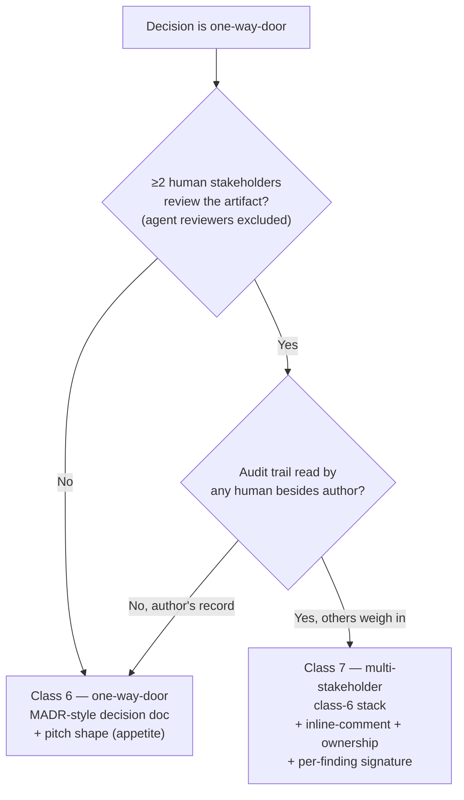

## Selector — task class → artifact set

Operational table for Stage 1. Maps `{class}` → `{artifact_set}`.

## Class table

| # | One-line | Detection signals | Artifact set (ordered) | Prewrite refs |
|---|---|---|---|---|
| 1 | Ad-hoc question | 0 file touches; transcript-only; reversible | (zero — plan-mode transcript) | — |
| 2 | One-off bug fix | 1 file touch; 1 stakeholder; reversible; non-recurring | `plan-mode` → PR description | `prewrite/plan-mode.md` |
| 3 | Research synthesis | reading + accept/reject; vault-write target | research-note folder (delegate to `/research-team`) | `prewrite/research-note.md` |
| 4 | Spec authoring | 3+ files; new skill/feature; single session | `requirements` → `design` → `task` | `prewrite/requirements.md`, `prewrite/design.md`, `prewrite/task.md` |
| 5 | Multi-stage build | cross-session continuity; multiple PRs/writers | same as 4 + per-stage status block | same as 4 |
| 6 | One-way-door decision | high cost-of-reversal; schema/auth/db pick | same as 4 + decision-doc emphasis (MADR-style "Considered options") | same as 4 |
| 7 | Multi-stakeholder review | ≥1 human reviewer besides author; per-finding audit needed | same as 6 + inline-comment affordance + ownership tag per artifact | same as 6 |

## Detection cheatsheet

- **File-touch count** — 0 (class 1), 1 (class 2), 3+ (class 4+).
- **Stakeholder count** — 1 human ⇒ class 1-6; ≥2 humans ⇒ class 7. Agent reviewers (verify, recycle-gate, post-YOLO auditor) don't count.
- **Reversibility** — two-way door ⇒ class 1-5; one-way ⇒ class 6+.
- **Cross-session continuity needed?** — yes ⇒ class 5+; no ⇒ class 4 or below.
- **Recurring-skill caveat** — even a class-2 typo fix in a recurring skill warrants a one-line status-block entry. Promote to class-2-with-status.

## Class 6 vs 7 — decision tree (only ambiguous case)

